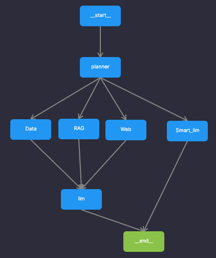

# Support System Documentation

## Overview
The Support system is an intelligent assistant framework designed to handle queries related to microscopes and microscopy. It combines multiple information retrieval methods including RAG (Retrieval Augmented Generation), web search, data analysis, and smart language model processing to provide accurate and contextual answers.

## Architecture
The system follows a stateful workflow using LangGraph to route queries through different processing nodes based on their content and requirements. The architecture is visualized in the following diagram:



### Core Components

#### 1. Main Processing Pipeline (`main.py`)
- **State Management**: Uses `CustomMessagesState` to track query flow and intermediate results
- **Query Routing**: Implements a planner that determines the appropriate processing path based on keywords:
  - **Data Queries**: Contains terms like "данные", "график", "csv", "таблица", "файл"
  - **Web Queries**: Contains terms like "когда", "сколько", "кто", "http", "www", "интернет", "найти", "web"
  - **RAG Queries**: Contains terms like "документ", "внутренний", "документации", "rag"
  - **Smart Processing**: Default fallback for complex queries requiring multiple approaches
- **Workflow Graph**: Orchestrates the flow between different processing nodes using conditional edges

#### 2. Agent System (`agent.py`)
- **Code Validation**: Implements AST-based security validation to prevent dangerous operations
- **Sandbox Execution**: Safe Python code execution with restricted modules and file access limited to `./sandbox/`
- **Tool Integration**: Provides secure execution of Python code, web search, and RAG retrieval
- **Security Features**:
  - Blacklist of forbidden modules (os, sys, subprocess, requests, etc.)
  - Whitelist of allowed modules (pandas, numpy, matplotlib, etc.)
  - Path validation to prevent directory traversal
  - AST visitor pattern for code analysis
- **Available Tools**:
  - `execute_python`: Executes Python code in a secure sandbox
  - `tool_web_search`: Performs web searches using DuckDuckGo
  - `tool_rag`: Retrieves information from internal documents

#### 3. RAG System (`rag.py`)
- **Document Loading**: Loads PDF documents (specifically `./data/Vinogradova.pdf`)
- **Text Processing**: Normalizes and cleans document content
- **Chunking**: Splits documents into manageable chunks using recursive character splitting
- **Vector Storage**: Uses FAISS for efficient similarity search with multilingual embeddings
- **Retrieval**: Performs semantic search to find relevant document sections

#### 4. Web Search (`web.py`)
- **DDG Integration**: Uses DuckDuckGo search API for web queries
- **Caching**: Implements MD5-based caching to avoid redundant searches
- **Result Formatting**: Structures search results with titles, snippets, and sources

## File Structure
```
Support/
├── agent.py              # Agent system with code validation and tools
├── main.py               # Main workflow and routing logic
├── rag.py                # RAG system implementation
├── web.py                # Web search functionality
├── demo.py               # Interactive demonstration script
├── README.md             # This documentation
├── graph.png             # System architecture diagram
├── requirements.txt      # Project dependencies
├── data/                 # Source documents for RAG
│   └── Vinogradova.pdf   # Microscopy reference document
├── faiss/                # Vector database storage
│   ├── index.faiss       # FAISS index file
│   └── index.pkl         # FAISS metadata file
├── sandbox/              # Secure execution environment for code
│   ├── g.png             # Sample output image
│   ├── g_planet.png      # Sample output image
│   ├── organisms.csv     # Sample data file
│   └── planet.csv        # Sample data file
├── workdir/              # Working directory for code execution
└── .env                  # Environment variables
```

## Environment Variables
The system requires the following environment variables in `.env`:
- `MODEL`: Name of the OpenAI model to use
- `API_KEY`: OpenAI API key
- `API_BASE`: OpenAI API base URL (optional)

## Dependencies
The system relies on the following key packages:
- `langchain-core`, `langchain-openai`, `langchain`: Core LangChain components
- `langgraph`: For creating stateful workflows
- `autogen`: For agent-based interactions
- `ddgs`: DuckDuckGo search integration
- `FAISS`: For vector storage and similarity search
- `HuggingFace`: For multilingual embeddings
- `pandas`, `numpy`, `matplotlib`: For data analysis and visualization

## Usage Examples
The system can handle various types of queries:

1. **RAG Queries**: Questions about internal documentation
   - Example: "(rag) назови изобретателя микроскопа"

2. **Web Queries**: Questions requiring external information
   - Example: "когда был изобретен микроскоп, посмотри в www"

3. **Data Queries**: Requests involving data analysis or visualization
   - Example: "напиши скрипт и выполни его в песочнице. сообщи о результатах. Задача: покажи csv и на основе него график в виде plot длин микроорганизмов..."

4. **Complex Queries**: Multi-step problems requiring multiple tools
   - Example: "найди в www сколько экзопланет открыто за все года наблюдений..."

## Security Features
The system implements multiple layers of security:
- Code validation using AST analysis
- Restricted module access in sandbox environment
- Path validation to prevent directory traversal
- Forbidden operations detection (system calls, network requests, etc.)

## Demo
Run the demo script to see the system in action:
```bash
python demo.py
```

The demo showcases various query types and how the system routes them through appropriate processing nodes.